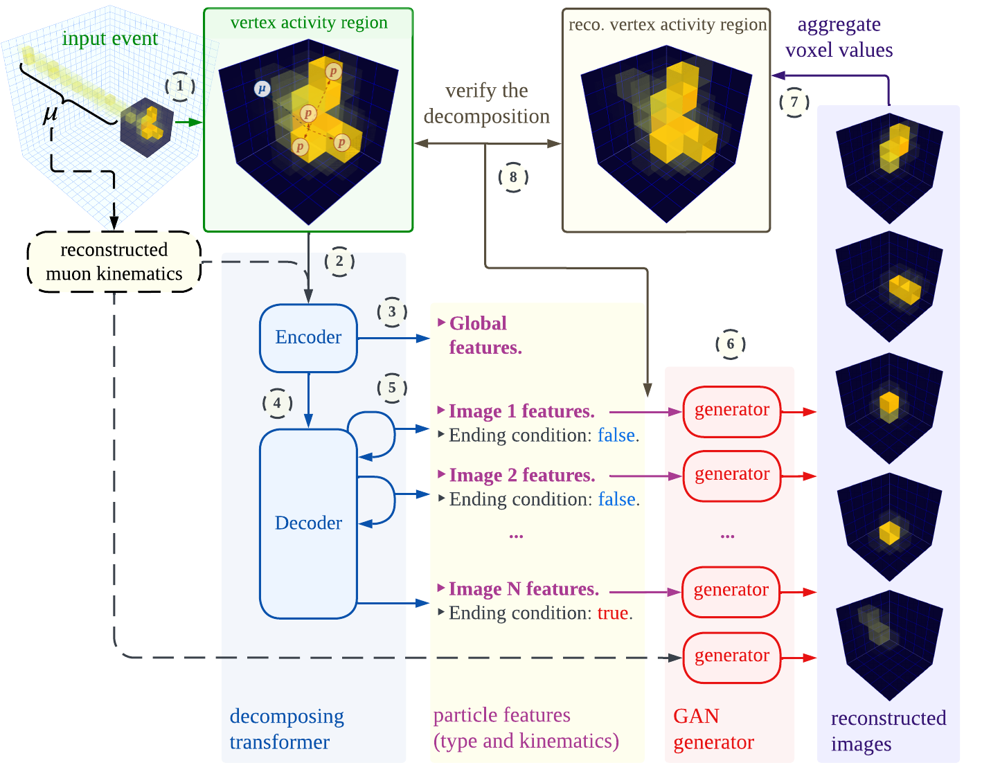

# Deep-learning-based decomposition for overlapping-sparse images of neutrino interactions

This repository contains the code and models for the deep learning-based image decomposition method presented in the paper titled ["Deep-learning-based decomposition of overlapping-sparse images: application at the vertex of neutrino interactions."](https://arxiv.org/abs/2310.19695) The paper addresses the problem of decomposing overlapping-sparse images, specifically focusing on applications in high-energy physics, where it plays a vital role in analysing neutrino interactions.

<div align="center">
  
</div>

## Abstract

<em>Image decomposition plays a crucial role in various computer vision tasks, enabling the analysis and manipulation of visual content at a fundamental level. Overlapping images, which occur when multiple objects or scenes partially occlude each other, pose unique challenges for decomposition algorithms. The task intensifies when working with sparse images, where the scarcity of meaningful information complicates the precise extraction of components. This paper presents a solution that leverages the power of deep learning to accurately extract individual objects within multi-dimensional overlapping-sparse images, with a direct application in high-energy physics with decomposition of overlaid elementary particles obtained from imaging detectors. In particular, the proposed approach tackles a highly complex yet unsolved problem: identifying and measuring independent particles at the vertex of neutrino interactions, where one expects to observe detector images with multiple indiscernible overlapping charged particles. By decomposing the image of the detector activity at the vertex through deep learning, it is possible to infer the kinematic parameters of the identified low-momentum particles - which otherwise would remain neglected - and enhance the reconstructed energy resolution of the neutrino event. We also present an additional step - that can be tuned directly on detector data - combining the above method with a fully-differentiable generative model to improve the image decomposition further and, consequently, the resolution of the measured parameters, achieving unprecedented results. This improvement is crucial for precisely measuring the parameters that govern neutrino flavor oscillations and searching for asymmetries between matter and antimatter.</em>

## Getting Started

To get started with the code and models, please follow the instructions provided in the following sections:

- [Dataset and checkpoints](docs/data.md): Learn how to download the required datasets for training and testing, as well as download pre-trained model checkpoints to use the deep learning-based image decomposition.
- [Training](docs/train.md): Find instructions for running the training of different models.
- [Testing](docs/test.md): Explore Jupyter notebooks for testing the different trained models.
- [License](LICENSE): View the license for this repository.
- [Dependencies](requirements.txt): Install the required dependencies by running the following command:

```bash
pip install -r requirements.txt
```

## Citation

If you use this code or the models in your research, please cite the corresponding paper:

    @misc{alonsomonsalve2023deeplearningbased,
          title={Deep-learning-based decomposition of overlapping-sparse images: application at the vertex of neutrino interactions}, 
          author={Saúl Alonso-Monsalve and Davide Sgalaberna and Xingyu Zhao and Adrien Molines and Clark McGrew and André Rubbia},
          year={2023},
          eprint={2310.19695},
          archivePrefix={arXiv},
          primaryClass={cs.CV}
    }

## License

This project is licensed under the [MIT](https://opensource.org/license/mit/) - see the [LICENSE](LICENSE) file for details.

## Acknowledgments

Part of this work was supported by the SNF grant PCEFP2\_203261, Switzerland.
